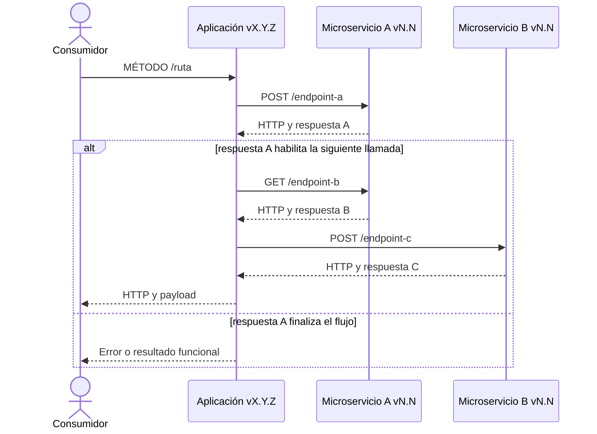
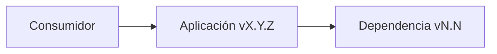
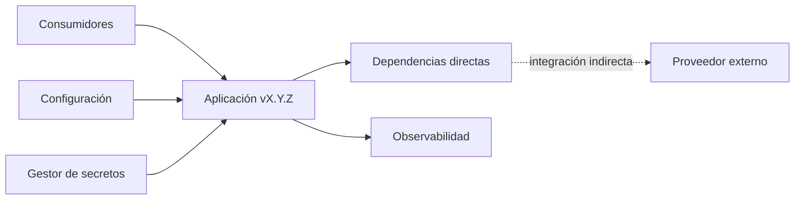

# Estándar para generar un manual técnico desde un repositorio

## 1. Propósito

Esta guía define un procedimiento reproducible para crear o actualizar el manual técnico de una
aplicación a partir de su implementación, contrato, configuración y artefactos operacionales.

Se puede usar en cualquier repositorio completando los parámetros de la sección 2. Los valores
incluidos son ejemplos y deben sustituirse por evidencia del proyecto analizado. Las rutas y nombres
mencionados fuera de dicha sección son convenciones: si el proyecto usa otra estructura, deben
localizarse sus equivalentes antes de generar el documento.

El objetivo no es describir cómo se espera que funcione el sistema, sino documentar el
comportamiento verificable de la revisión actual del repositorio.

## 2. Parámetros del proyecto

Completar esta ficha antes de comenzar. No dejar marcadores sin resolver en el manual final.

| Parámetro | Ejemplo neutral | Descripción |
| --- | --- | --- |
| `PROJECT_ROOT` | `/ruta/al/repositorio` | Directorio desde el cual se ejecutan las comprobaciones. |
| `APPLICATION_NAME` | `aplicacion-ejemplo` | Nombre desplegable o identificador principal. |
| `APPLICATION_TYPE` | API web sobre `<framework y versión>` | Tipo de aplicación: API, BFF, microservicio, worker, librería, etc. |
| `CONSUMERS` | aplicación web, aplicación móvil y sistemas internos | Sistemas o actores que consumen la aplicación. |
| `SOLUTION_FILE` | `ruta/al/archivo-de-solucion` | Solución, workspace o archivo equivalente que agrupa los proyectos; usar `no aplica` si no existe. |
| `APPLICATION_PROJECT` | `ruta/al/proyecto-principal` | Proyecto ejecutable principal; usar `no aplica` cuando el ecosistema no emplee archivos de proyecto. |
| `SOURCE_ROOT` | `src/` | Raíz del código fuente de la aplicación. |
| `TEST_ROOT` | `tests/` | Raíz de las pruebas automatizadas. |
| `BOOTSTRAP_FILE` | `src/ruta/al/punto-de-entrada` | Punto de entrada y configuración inicial de la aplicación. |
| `COMPOSITION_FILE` | `src/ruta/al/archivo-de-composicion` | Registro efectivo de módulos o componentes; usar el bootstrap si no existe un archivo separado. |
| `CONTRACT_FILE` | `contracts/openapi.yaml` | Contrato OpenAPI u otro contrato publicado; indicar si se genera en ejecución o si no aplica. |
| `CONFIG_DIR` | `config/` y variables proporcionadas por la plataforma de despliegue | Configuraciones versionadas y mecanismos externos disponibles. |
| `OUTPUT_FILE` | `docs/manual-tecnico.md` | Manual que se generará o actualizará. |
| `VERSION_SOURCE` | `ruta/al/manifiesto-de-version` | Fuente primaria de la versión; indicar la propiedad o etiqueta consultada. |
| `RELEASE_SOURCE` | `ruta/al/pipeline`, `ruta/al/contenedor` y `ruta/a/manifiestos` | Fuentes de contraste de construcción y despliegue. |
| `CONFIG_PRIORITY` | producción → certificación → desarrollo | Orden para escoger configuración de la misma versión. |
| `BUSINESS_PATH_STYLE` | ruta absoluta con prefijo configurable `<BASE_PATH>` | Forma de presentar las rutas o interfaces públicas. |
| `REQUIRE_SEQUENCE_PER_OPERATION` | `sí` | Ejemplo de perfil que exige un diagrama por operación con cada llamada externa. |
| `REQUIRE_COMPONENTS_PER_OPERATION` | `no` | Ejemplo de perfil que omite diagramas de componentes redundantes por operación. |
| `INCLUDE_OPERATIONAL_ENDPOINTS` | `sí`; incluir salud, métricas y documentación de API cuando existan | Define si se documentan interfaces operacionales además de las de negocio. |
| `DOCUMENT_INTERNAL_ARCHITECTURE` | `sí`; detallar el flujo entre entrada pública, caso de uso, puertos y adaptadores | Nivel de detalle de los diagramas de integración. |

Antes de usar la guía, copiar la ficha y sustituir todos los valores de la columna “Ejemplo neutral”.
Si una fuente no existe, indicar `no aplica` y definir qué evidencia equivalente se utilizará.

Los parámetros `REQUIRE_*` constituyen el **perfil documental**. Permiten conservar el estándar sin
imponer diagramas redundantes a sistemas simples. Sus valores deben definirse para cada proyecto a
partir del alcance acordado y la complejidad verificable del sistema.

## 3. Resultado esperado

El manual debe permitir que una persona que no conoce el código pueda responder, con trazabilidad:

- qué responsabilidad tiene la aplicación y quién la consume;
- qué versión y revisión del repositorio documenta;
- qué interfaces expone y cuáles están realmente activas;
- qué entradas, salidas, errores y reglas relevantes tiene cada operación;
- qué componentes internos participan y qué dependencias externas se consumen;
- cómo se configura, protege, ejecuta, despliega, observa y diagnostica;
- qué discrepancias, limitaciones o aspectos no verificables existen;
- de qué archivo y ubicación se obtuvo cada afirmación importante.

El documento debe ser autosuficiente, pero no debe copiar secretos, datos personales, hosts
internos innecesarios ni grandes fragmentos de código.

## 4. Principios de generación

1. **Código ejecutable antes que documentación previa.** El registro de componentes, las rutas y la
   implementación prevalecen sobre README, diagramas o contratos desactualizados.
2. **Contrato como contraste.** OpenAPI, AsyncAPI, GraphQL u otro contrato ayuda a detectar
   diferencias; no reemplaza la inspección del código.
3. **Configuración por ambiente como evidencia operacional.** Se usa para identificar dependencias,
   versiones y flags, nunca para publicar credenciales o direcciones sensibles.
4. **Trazabilidad.** Toda conclusión importante debe poder vincularse a un archivo, símbolo o
   configuración revisada.
5. **Sin inferencias silenciosas.** Marcar una afirmación como inferida, ambigua o no verificable
   cuando la evidencia no sea concluyente.
6. **Repetibilidad.** Registrar versión, commit o rama, fecha, fuentes seleccionadas y comandos de
   validación.
7. **Cambio mínimo.** Al actualizar un manual existente, conservar contenido válido y modificar solo
   aquello afectado por la implementación actual.
8. **Separación de niveles.** Distinguir aplicación, componentes internos, servicios aguas abajo y
   proveedores transitivos; no representar una relación indirecta como llamada directa.
9. **Configurado no significa activo.** Contrastar cada variable con llamadas y componentes
   registrados antes de afirmar que una integración participa en ejecución.
10. **Un solo inventario canónico.** Los capítulos, la matriz y los anexos deben derivarse de la misma
    lista de operaciones para evitar conteos o rutas divergentes.

## 5. Fuentes de verdad y precedencia

Localizar y leer los archivos completos relevantes, no solo coincidencias de búsquedas. Aplicar esta
prioridad, adaptando las rutas al framework:

| Prioridad | Fuente | Evidencia esperada |
| ---: | --- | --- |
| 1 | Registro o composición de módulos/componentes | Interfaces y componentes efectivamente activos. |
| 2 | Controladores, routers, handlers o resolvers | Métodos, rutas, parámetros, headers y respuestas declaradas. |
| 3 | Servicios y casos de uso | Flujo, integraciones, reglas, transformaciones y errores. |
| 4 | DTO, schemas, tipos y validadores | Contratos de entrada/salida, obligatoriedad y restricciones. |
| 5 | Guards, middleware, filtros e interceptores | Seguridad y comportamiento transversal. |
| 6 | Clases o esquemas de variables de entorno | Configuración admitida por el código. |
| 7 | Configuración de la misma versión | Dependencias, versiones, flags y parámetros de ejecución. |
| 8 | Bootstrap y configuración del framework | Prefijos, puertos, documentación y ciclo de inicio. |
| 9 | Contrato publicado | Contraste de operaciones, modelos y respuestas. |
| 10 | Contenedores, despliegue, CI/CD y observabilidad | Construcción, recursos, probes, releases y diagnóstico. |
| 11 | Pruebas | Casos límite y comportamiento observable adicional. |
| 12 | Documentación y diagramas existentes | Contexto histórico que debe confirmarse con fuentes superiores. |

Ante una discrepancia:

1. confirmar que se comparan la misma versión y ambiente;
2. describir el comportamiento ejecutable;
3. registrar ambas representaciones y su fuente;
4. explicar el impacto sin corregir ni ocultar la diferencia en el manual;
5. no decidir arbitrariamente si la evidencia sigue siendo ambigua.

## 6. Flujo de trabajo

### 6.1 Preparar el contexto

1. Leer las instrucciones locales del repositorio (`AGENTS.md`, `CONTRIBUTING.md` o equivalente).
2. Confirmar que `OUTPUT_FILE` es la ruta correcta.
3. Registrar fecha, rama y commit actual.
4. Obtener la versión desde `VERSION_SOURCE` y contrastarla con `RELEASE_SOURCE`, etiquetas o
   manifiestos de despliegue.
5. Revisar el estado de Git para no sobrescribir cambios de otra persona.
6. Definir el ambiente documental y el archivo de configuración según la sección 6.2.

Comandos orientativos:

```bash
git branch --show-current
git rev-parse --short HEAD
git status --short
```

### 6.2 Seleccionar configuración y ambiente

Para configuraciones versionadas, aplicar este orden salvo que el proyecto establezca otro:

1. Producción.
2. QA, certificación o staging.
3. Integración o desarrollo.

La configuración elegida debe corresponder exactamente a la versión documentada. No completar
datos faltantes con otra versión.

- Si se usa un ambiente secundario, explicarlo en el alcance del manual.
- Si hay varios candidatos equivalentes, detener la selección y resolver la ambigüedad.
- Si no existe configuración de la versión, registrar el bloqueo o limitar explícitamente la
  documentación; no inventar versiones de dependencias.
- Si las versiones se resuelven dinámicamente, documentarlas como tales.

### 6.3 Inventariar interfaces expuestas

1. Leer el archivo de composición y enumerar solo controladores, routers, consumers, jobs o
   resolvers registrados.
2. Para HTTP, combinar el prefijo del controlador/router con cada método y ruta.
3. Incorporar prefijos globales solo si están configurados en el bootstrap. Si son variables,
   documentarlos como marcadores, por ejemplo `<BASE_PATH>`.
4. Separar interfaces de negocio de interfaces operacionales, como health, métricas y documentación.
5. Comparar el inventario ejecutable con el contrato publicado.
6. Registrar operaciones presentes solo en una de las dos fuentes.

Ejemplo para proyectos NestJS:

```bash
rg -n '@Controller|@(Get|Post|Put|Patch|Delete)\(' src
rg -n 'controllers:\s*\[' src
```

No utilizar el conteo textual como inventario definitivo: decoradores multilínea, rutas generadas,
versionado de API o composición dinámica requieren inspección del código.

### 6.4 Trazar cada operación

Para cada interfaz activa, recorrer como mínimo:

```text
consumidor -> entrada pública -> validación/seguridad -> caso de uso
            -> dependencias externas -> transformación -> respuesta/error
```

Registrar:

- propósito y actor;
- método, ruta, evento o nombre de operación;
- acceso público/protegido y permisos;
- parámetros, headers y cuerpo relevantes;
- DTO o schema de entrada y salida;
- validaciones y reglas visibles;
- llamadas externas en orden, incluidas ramas, paralelismo, reintentos o fallbacks;
- flags que cambian el flujo;
- estado HTTP o resultado de transporte;
- código y mensaje del payload, si son distintos;
- errores locales, propagados y dinámicos;
- ubicación de la evidencia principal.

### 6.5 Inventariar dependencias

Cruzar las llamadas reales del código con las variables de configuración seleccionadas. Para cada
dependencia indicar:

| Dependencia | Tipo | Versión | Clave de configuración | Operaciones que la usan | Observaciones |
| --- | --- | --- | --- | --- | --- |
| Servicio o sistema | API, cola, base de datos, proveedor, etc. | Fija o dinámica | Nombre de variable, sin valor sensible | Lista o capítulo | Uso, fallback o estado. |

No confundir:

- variable declarada con variable realmente utilizada;
- integración directa con integración transitiva;
- nombre lógico con hostname;
- versión de la aplicación con versión del servicio aguas abajo.

Las variables configuradas pero no utilizadas también deben señalarse, pues explican diferencias
entre despliegue e implementación.

### 6.6 Documentar respuestas y errores

Combinar decoradores o contratos, retornos de servicios, constantes, filtros globales y pruebas.

- Diferenciar transporte (`HTTP 400`) de código de negocio (`payload.code = 1020`).
- Conservar literalmente solo mensajes definidos como constantes en el repositorio.
- Representar mensajes propagados mediante plantillas, por ejemplo `{codigo} | {mensaje}`.
- Explicar la condición de cada código especial.
- No inventar respuestas por simetría con otras operaciones.
- Señalar inconsistencias entre implementación y contrato.

### 6.7 Documentar aspectos transversales

Revisar y describir solo lo que exista:

- autenticación, autorización y rutas públicas;
- validación, sanitización y manejo de errores;
- secretos y configuración;
- persistencia, cache y mensajería;
- timeouts, reintentos y circuit breakers;
- logging, trazas, métricas y correlación;
- health checks y dependencias de disponibilidad;
- compilación, ejecución local y contenedor;
- recursos, escalado y despliegue;
- pipeline, estrategia de release y rollback;
- limitaciones o riesgos técnicos relevantes.

No afirmar verificación criptográfica, cifrado, redacción de datos, alta disponibilidad u otra
protección sin evidencia directa.

### 6.8 Generar diagramas

Incluir diagramas solo cuando aclaren relaciones o secuencias. Mermaid es el formato preferido por
ser versionable en Markdown.

Como mínimo para una API/BFF compleja:

- un diagrama de contexto o arquitectura general;
- un diagrama de secuencia por operación o por flujo cuando varias operaciones sean equivalentes;
- un diagrama de componentes por operación solo si el estándar del proyecto lo exige.

Reglas:

- usar nombres lógicos y versiones verificadas;
- mantener la dirección real de las llamadas;
- distinguir dependencias directas de indirectas;
- representar `alt`, `opt`, `loop` o `par` cuando afecten el comportamiento;
- tratar la aplicación como caja negra en diagramas de integración, salvo que el objetivo sea mostrar
  explícitamente su arquitectura interna;
- omitir secretos, tokens, datos personales y hosts internos.

Cuando `REQUIRE_SEQUENCE_PER_OPERATION = sí`, cada operación debe tener exactamente un
`sequenceDiagram`. Debe mostrar consumidor, aplicación versionada, todas las dependencias que
participan y retorno; el orden, las condiciones y el paralelismo deben reflejar el código.

El diagrama de secuencia debe representar **cada llamada saliente real** que la operación pueda
realizar a un microservicio, API o endpoint externo. No se permite resumir varias llamadas bajo una
única interacción genérica como `Solicitud a dependencias` o `Llamar servicios aguas abajo`.

- Declarar un participante identificable por cada microservicio o sistema externo involucrado.
- Dibujar una interacción independiente por cada invocación de endpoint, indicando como mínimo el
  método HTTP y el nombre o ruta lógica configurada, sin publicar hosts internos ni datos sensibles.
- Si varias llamadas se dirigen al mismo microservicio, conservar un participante común, pero
  mostrar cada endpoint invocado como un mensaje separado y en su orden de ejecución.
- Representar llamadas condicionales, alternativas, reintentos, fallbacks y errores mediante
  bloques `alt`, `opt`, `loop` o `break`, según corresponda al código.
- Representar con `par` únicamente las llamadas que la implementación ejecute realmente en
  paralelo; no inferir paralelismo por independencia funcional.
- Incluir las respuestas de cada endpoint cuando condicionen la llamada siguiente, el mapeo o el
  resultado público.
- Cuando un flujo no realice llamadas externas, mostrar explícitamente el procesamiento local y
  dejar constancia de que no existe integración aguas abajo.

Cuando `REQUIRE_COMPONENTS_PER_OPERATION = sí`, cada operación debe tener exactamente un
`flowchart` de componentes, incluso si no consume servicios externos. En ese caso debe mostrar al
menos consumidor → aplicación y explicar que no hay integración aguas abajo para ese flujo.

El diagrama general debe cubrir, si existen, consumidores, aplicación, configuración centralizada,
gestor de secretos, observabilidad, persistencia, mensajería, servicios aguas abajo y proveedores
indirectos. La flecha debe representar el sentido semántico real: por ejemplo, “la aplicación obtiene
configuración” no equivale a “la aplicación administra el servidor de configuración”.

### 6.9 Construir capítulos transversales

Después de documentar las operaciones, consolidar sin duplicar:

1. **Catálogo de respuestas y códigos:** código observado, interpretación o mensaje literal y origen.
2. **Seguridad y errores:** guard/middleware global, rutas públicas, autenticación, autorización,
   tratamiento de tokens, sanitización de logs y conversión de errores.
3. **Configuración y ejecución:** prefijo, puerto, flags, secretos, comandos soportados y contrato.
4. **Operación y despliegue:** imagen, proceso de inicio, probes, recursos, escalado, CI/CD y release.
5. **Diagnóstico:** comprobaciones ordenadas desde salud y configuración hasta dependencia y error.
6. **Limitaciones/discrepancias:** diferencias entre código, contrato, configuración y documentación.

Los comandos deben copiarse desde los scripts o manifiestos vigentes, no desde memoria. Los recursos,
réplicas, puertos y probes deben provenir de archivos de despliegue. Si la aplicación no tiene base de
datos, cache, cola u otra infraestructura esperable, indicarlo solo cuando pueda verificarse.

### 6.10 Construir matrices y anexos

Generar desde el inventario canónico:

- una matriz por capítulo o dominio con cantidad de operaciones y prefijos;
- un anexo completo con sección, método/tipo, ruta/nombre, descripción y acceso;
- un apartado separado para endpoints operacionales;
- un anexo de fuentes ordenado por prioridad, indicando el uso de cada una.

La suma de operaciones de la matriz debe coincidir con los capítulos y el anexo. Los endpoints
operacionales no deben alterar el conteo de operaciones de negocio salvo que el perfil lo defina así.

## 7. Estructura recomendada del manual

Adaptar capítulos al tipo de sistema, manteniendo esta base:

1. Control de versiones del documento.
2. Alcance, versión, ambiente, rama/commit y criterio de documentación.
3. Resumen ejecutivo.
4. Arquitectura o contexto general.
5. Interfaces y consumidores.
6. Dependencias e integraciones configuradas.
7. Capítulos funcionales con las operaciones.
8. Catálogo de respuestas, eventos o errores.
9. Seguridad y manejo de datos.
10. Configuración y flags.
11. Ejecución, despliegue y operación.
12. Observabilidad y diagnóstico.
13. Limitaciones y discrepancias conocidas.
14. Matriz de clasificación o cobertura.
15. Anexo de inventario completo.
16. Anexo de fuentes técnicas.

Omitir secciones que realmente no apliquen y explicar la ausencia cuando pueda interpretarse como
una omisión accidental.

Si el perfil documental exige cobertura detallada de una API, puede declarar obligatorias las
secciones 1 a 12, la matriz y ambos anexos. En ese caso, cada capítulo funcional debe declarar su
cantidad de operaciones y agruparlas por capacidad de negocio, no simplemente por nombre de archivo.

## 8. Plantillas

### 8.1 Control de versiones

```markdown
| Versión | Fecha | Autor | Cambio |
| --- | --- | --- | --- |
| 1.0 | AAAA-MM-DD | Equipo o responsable | Generación desde código y configuración de la versión X.Y.Z. |
```

### 8.2 Operación HTTP

````markdown
## N.N MÉTODO `/ruta/:parametro`

**Descripción:** Propósito verificable de la operación.

**Acceso:** Público/protegido; mecanismo y permisos relevantes.

**Entrada relevante:** Headers, parámetros, query y body relevantes; DTO o schema.

**Casos de respuesta:**

| HTTP | Código en payload | Mensaje o condición | Fuente |
| ---: | --- | --- | --- |
| `200` | `200` | Condición de éxito. | Controlador/servicio/contrato. |
| `4xx` | Código funcional | Validación o regla de negocio. | Servicio/constante. |
| `500` | `500` | Error técnico documentado. | Filtro/controlador. |



**Componentes e integraciones:** `Dependencia vN.N` (`VARIABLE_CONFIG`).



**Fuentes:** `ruta/al/controlador`, `ruta/al/servicio`, `ruta/al/dto`.
````

### 8.3 Discrepancia

```markdown
> **Discrepancia verificada:** el contrato declara `<valor A>`, mientras que la implementación
> ejecutable produce `<valor B>`. Evidencias: `<archivo/símbolo A>` y `<archivo/símbolo B>`.
> Impacto: `<efecto observable>`.
```

### 8.4 Arquitectura general

````markdown
# Arquitectura general



Explicar responsabilidades, límites, persistencia —o su ausencia verificada— y el significado de
las relaciones directas e indirectas.
````

### 8.5 Dependencias configuradas

```markdown
| Dependencia | Versión configurada | Variable(s) | Uso desde la aplicación |
| --- | --- | --- | --- |
| `servicio-ejemplo` | `v1.2` | `ENDPOINT_EJEMPLO` | Operaciones o propósito. |
| `servicio-sin-uso` | `v2.0` | `ENDPOINT_NO_USADO` | Configurada, sin uso directo verificable. |
```

### 8.6 Matriz e inventarios

```markdown
| Capítulo | Dominio | Operaciones | Prefijos o interfaces |
| ---: | --- | ---: | --- |
| 1 | Dominio funcional | N | `/prefijo` |

| Sección | Método/tipo | Ruta o nombre | Descripción | Acceso |
| --- | --- | --- | --- | --- |
| 1.1 | `GET` | `/recurso/:id` | Finalidad. | Protegido/público. |

| Prioridad | Fuente | Uso |
| ---: | --- | --- |
| 1 | `ruta/al/archivo` | Evidencia obtenida. |
```

## 9. Control de calidad

### 9.1 Cobertura

Construir una lista canónica de interfaces y comprobar que cada una tenga una única sección en el
manual. Para APIs HTTP, comparar al menos estos conjuntos:

```text
operaciones registradas en código
operaciones publicadas en el contrato
operaciones descritas en el manual
operaciones listadas en el anexo
```

Las diferencias deben ser cero o estar explicadas explícitamente.

Verificar además:

- todas las dependencias llamadas por código aparecen en el inventario;
- cada llamada saliente a un microservicio o endpoint identificada en controller, service,
  orquestador o EndpointClient aparece como una interacción individual en el `sequenceDiagram` de
  la operación correspondiente;
- ninguna interacción genérica agrupa varias invocaciones externas y el orden, las condiciones y el
  paralelismo de los diagramas coinciden con la implementación;
- todas las claves de endpoints del ambiente seleccionado están documentadas como usadas o no usadas;
- todos los códigos y mensajes identificables están cubiertos;
- capítulos, matriz y anexo usan la misma numeración;
- versión, nombres y ambiente son consistentes en texto y diagramas;
- no quedan marcadores como `TODO`, `TBD`, `X.Y.Z` o `<...>` salvo variables intencionales;
- no se exponen secretos, credenciales, tokens, datos personales ni hosts restringidos.

Cuando el perfil HTTP requiera detalle por operación, los conteos de descripción, entrada,
respuestas, integraciones y secuencias deben coincidir exactamente con el número de endpoints. Si
también exige componentes por operación, los `flowchart` deben coincidir con ese número más los
diagramas generales adicionales identificados.

El siguiente ejemplo Bash aplica al perfil con una secuencia por operación y al formato de títulos
mostrado en la sección 8.2. Ejecútalo como un bloque completo: devuelve un código distinto de cero
si falta una sección obligatoria, falla una lectura o difiere un conteo. El subshell limita las
opciones de error al bloque. Los conteos complementan la reconciliación del inventario; no detectan
por sí solos una operación omitida y otra duplicada.

```bash
(
    set -eu
    manual_file='docs/manual-tecnico.md'

    endpoints=$(rg -c '^## [0-9]+\.[0-9]+ (GET|HEAD|POST|PUT|PATCH|DELETE|OPTIONS|CONNECT|TRACE) ' "$manual_file")
    descriptions=$(rg -c '^\*\*Descripción:\*\*' "$manual_file")
    inputs=$(rg -c '^\*\*Entrada relevante:\*\*' "$manual_file")
    responses=$(rg -c '^\*\*Casos de respuesta:\*\*$' "$manual_file")
    integrations=$(rg -c '^\*\*Componentes e integraciones:\*\*' "$manual_file")
    sequences=$(rg -c '^sequenceDiagram$' "$manual_file")

    test "$endpoints" -gt 0
    test "$endpoints" -eq "$descriptions"
    test "$endpoints" -eq "$inputs"
    test "$endpoints" -eq "$responses"
    test "$endpoints" -eq "$integrations"
    test "$endpoints" -eq "$sequences"
)
```

Validar también la cobertura de claves de integración. Adaptar `ENDPOINT_` a la convención real:

```bash
config_file='ruta/al/archivo-de-configuracion-seleccionado.yml'
manual_file='ruta/al/manual-tecnico.md'

comm -23 \
  <(rg -o 'ENDPOINT_[A-Z0-9_]+' "$config_file" | sort -u) \
  <(rg -o 'ENDPOINT_[A-Z0-9_]+' "$manual_file" | sort -u)
```

El último comando no debe producir salida. Si produce resultados, documentar cada clave faltante
como utilizada o no utilizada.

### 9.2 Markdown, Mermaid y enlaces

```bash
# Cercas: el total debe ser par.
rg -c '^```' "$OUTPUT_FILE"

# Marcadores accidentales: revisar cada coincidencia.
rg -n 'TODO|TBD|X\.Y\.Z|AAAA-MM-DD' "$OUTPUT_FILE"

# Espacios, conflictos y errores de parche.
git diff --check
```

Si el repositorio dispone de linters para Markdown, Mermaid o enlaces, ejecutarlos. Para enlaces
locales, comprobar que el destino exista y que la ruta sea relativa al archivo del manual.

Si Mermaid CLI está disponible, renderizar todos los diagramas. Un conteo correcto de cercas no
garantiza que la sintaxis Mermaid sea válida.

### 9.3 Revisión técnica final

Releer el documento contra las fuentes y buscar:

- rutas o componentes omitidos;
- flujos simplificados que cambien el significado;
- versiones deducidas sin evidencia;
- errores HTTP mezclados con códigos funcionales;
- dependencias indirectas dibujadas como directas;
- instrucciones operacionales que no coincidan con scripts o manifiestos;
- afirmaciones de seguridad no implementadas;
- duplicación, contradicciones y contenido histórico presentado como vigente.

### 9.4 Matriz de aceptación del estándar

Antes de cerrar, marcar cada fila como cumplida, no aplicable con justificación o discrepancia
documentada:

| Característica | Evidencia mínima |
| --- | --- |
| Identidad documental | Versión del documento, fecha, autor y cambio. |
| Alcance técnico | Aplicación, versión, revisión, ambiente, consumidores y exclusiones. |
| Resumen ejecutivo | Responsabilidad, capacidades y límites principales. |
| Arquitectura | Contexto general y relaciones directas/indirectas. |
| Dependencias | Nombre, versión, clave y uso o ausencia de uso. |
| Operaciones | Inventario reconciliado entre composición, código, contrato y manual. |
| Detalle por operación | Descripción, entrada, respuestas, integraciones, diagramas y fuentes. |
| Errores | Estados de transporte, códigos funcionales, mensajes y discrepancias. |
| Seguridad | Acceso, tokens, permisos, datos sensibles y manejo de errores. |
| Configuración | Variables funcionales, flags, prefijo, puerto y secretos sin valores. |
| Ejecución | Instalación, compilación, inicio, lint y pruebas disponibles. |
| Operación | Contenedor, health, recursos, escalado, observabilidad y CI/CD. |
| Diagnóstico | Secuencia accionable de comprobaciones. |
| Matriz | Dominios, cantidades y prefijos reconciliados. |
| Anexos | Inventario de negocio, endpoints operacionales y fuentes técnicas. |
| Calidad | Conteos, contrato, configuración, enlaces, Mermaid y `git diff --check`. |

## 10. Actualización de documentación relacionada

Después de cambiar el manual, revisar README, contrato, diagramas, inventarios, changelog y worklog.
Modificar únicamente los artefactos afectados y obedecer las reglas locales del repositorio. Un
cambio exclusivamente documental no autoriza por sí mismo cambios de código o contrato.

Si las instrucciones locales excluyen cambios exclusivamente documentales de `WORKLOG.md` o
`CHANGELOG.md`, respetar esa regla y registrar la excepción solo en el informe de entrega.

## 11. Criterios de finalización

La generación termina cuando:

- el manual representa la implementación, versión y ambiente actuales;
- el inventario está completo y reconciliado con el contrato;
- cada operación contiene el nivel de detalle definido para el proyecto;
- integraciones, versiones, respuestas y errores tienen evidencia;
- discrepancias y límites de verificación están visibles;
- diagramas, enlaces y Markdown son válidos;
- no hay información sensible ni marcadores accidentales;
- se registraron los comandos de validación y sus resultados;
- la diferencia de Git contiene solo los cambios documentales necesarios.

## 12. Instrucción reutilizable para un agente generador

El siguiente bloque puede usarse como solicitud base en otro repositorio después de completar la
ficha de parámetros:

```text
Genera o actualiza el manual técnico definido por OUTPUT_FILE siguiendo
docs/instrucciones-generacion-manual-tecnico.md.

Trabaja desde el comportamiento ejecutable de la revisión actual. Lee completos el registro de
componentes, interfaces públicas, servicios, contratos, tipos, seguridad, bootstrap, configuración,
pruebas y artefactos operacionales relevantes. Reconcilia el inventario del código con el contrato.
No inventes datos faltantes ni expongas información sensible.

Antes de editar, informa versión, ambiente/configuración seleccionada, alcance, archivos previstos y
validaciones. Documenta discrepancias con sus fuentes. Al terminar, ejecuta las comprobaciones de
cobertura, Markdown, diagramas, enlaces y git diff --check, y reporta resultados y limitaciones.
Respeta las instrucciones locales del repositorio y no amplíes el alcance sin autorización.
```
